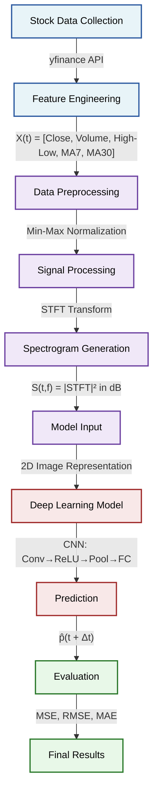

# Stock Price Prediction using STFT + CNN
### Assignment 2 — Pattern Recognition for Financial Time Series

---

## 📌 Overview

This project predicts future stock prices by treating financial time series data
as signals, converting them into spectrograms using the Short-Time Fourier Transform
(STFT), and training a Convolutional Neural Network (CNN) to recognize patterns and
make predictions.

---

## 🏢 Companies Used

| Company | Ticker | Sector |
|---------|--------|--------|
| Reliance Industries | RELIANCE.NS | Energy / Conglomerate |
| Infosys | INFY.NS | Information Technology |
| Wipro | WIPRO.NS | Information Technology |
| Tata Consultancy Services | TCS.NS | Information Technology |

---

## 📁 Project Structure

```
stock_prediction_project/
├── data/
│   ├── RELIANCE_NS_raw.csv         ← Raw stock data (Close, Volume, HL_Range, MA7, MA30)
│   ├── INFY_NS_raw.csv
│   ├── WIPRO_NS_raw.csv
│   ├── TCS_NS_raw.csv
│   ├── combined_raw.csv            ← Aligned Close prices for all stocks
│   ├── combined_normalized.csv     ← Min-Max normalized Close prices
│   ├── stock_data.xlsx             ← All data in Excel format (6 sheets)
│   ├── *_spectrogram.npy           ← Saved spectrogram arrays
│   └── evaluation_metrics.txt      ← Final MSE, RMSE, MAE results
│
├── images/
│   ├── all_stocks_timeseries.png   ← Combined normalized price chart
│   ├── *_analysis.png              ← Time series + FFT + Spectrogram per stock
│   ├── *_spectrogram.png           ← Close price spectrogram per stock
│   ├── *_multifeature_spec.png     ← All 5 feature spectrograms per stock
│   ├── training_history.png        ← Loss and MAE curves during training
│   └── actual_vs_predicted.png     ← Prediction vs actual comparison
│
├── models/
│   └── cnn_stock_model.keras       ← Saved trained CNN model
│
├── main.py                         ← Full pipeline (run this)
├── requirements.txt                ← Python dependencies
├── .gitignore                      ← Git ignore rules
└── README.md                       ← This file
```

---

## ⚙️ Setup & Installation

### 1. Clone or download the project
```bash
cd StockPredictor
```

### 2. Create a virtual environment
```bash
python -m venv .venv
```

### 3. Activate the virtual environment

**Windows (PowerShell):**
```powershell
.venv\Scripts\Activate.ps1
```

**Mac / Linux:**
```bash
source .venv/bin/activate
```

### 4. Install dependencies
```bash
pip install -r requirements.txt
```

---

## ▶️ Running the Project

```powershell
python main.py
```

The pipeline runs all 6 steps automatically:

```
Step 1/6 : Data Collection & Normalization
Step 2/6 : Generating STFT Spectrograms
Step 3/6 : Visualizing
Step 4/6 : Preparing CNN Dataset
Step 5/6 : Training
Step 6/6 : Evaluation
```

> **Note:** Stock CSVs are cached after the first run. Subsequent runs will be faster.

---

## 🔄 Pipeline



---

## 📡 Signal Processing Parameters

| Parameter | Value | Description |
|-----------|-------|-------------|
| Window Length (L) | 128 days | Samples per STFT segment |
| Hop Size (H) | 8 days | Step between windows (L - overlap) |
| Overlap | 120 days | L - H |
| Sampling Rate (fs) | 1 | 1 sample per trading day |
| Frequency Bins | 65 | Output frequency resolution |
| Prediction Step (Δt) | 5 days | Days ahead to predict |

---

## 🤖 CNN Architecture

```
Input  (65 × 30 × 5)
  │
  ├─ Conv2D(32, 3×3) + BatchNorm + ReLU + MaxPool(2×2)
  ├─ Conv2D(64, 3×3) + BatchNorm + ReLU + MaxPool(2×2)
  ├─ Conv2D(128, 3×3) + BatchNorm + ReLU + GlobalAvgPool
  │
  ├─ Dense(256) + Dropout(0.4)
  ├─ Dense(64)  + Dropout(0.2)
  └─ Dense(1)   ← Predicted normalized price
```

| Detail | Value |
|--------|-------|
| Total Parameters | 144,257 |
| Loss Function | Mean Squared Error (MSE) |
| Optimizer | Adam |
| Early Stopping | patience = 15 |
| Learning Rate Decay | ReduceLROnPlateau (factor=0.5) |
| Regularization | L2 (1e-4) + Dropout |

---

## 📊 Results

| Metric | Value |
|--------|-------|
| MSE  (Mean Squared Error) | 0.014617 |
| RMSE (Root Mean Squared Error) | 0.120902 |
| MAE  (Mean Absolute Error) | 0.103184 |
| Best Epoch | 73 / 88 |
| Training Days | 1947 |
| Features per Stock | 5 |

> All prices are Min-Max normalized to [0, 1] scale.
> An MAE of ~0.10 means predictions are off by ~10% of the price range on average.

---

## 📦 Dependencies

```
yfinance        ← Stock data download
numpy           ← Numerical operations
pandas          ← Data manipulation
scipy           ← STFT signal processing
matplotlib      ← Plotting and visualization
scikit-learn    ← Min-Max normalization
tensorflow      ← CNN model
openpyxl        ← Excel export
```

Install all with:
```bash
pip install -r requirements.txt
```

---

## 📚 References

1. Y. Zhang and C. Aggarwal, "Stock Market Prediction Using Deep Learning," IEEE Access.
2. A. Tsantekidis et al., "Deep Learning for Financial Time Series Forecasting."
3. S. Hochreiter and J. Schmidhuber, "Long Short-Term Memory," Neural Computation, 1997.
4. A. Borovykh et al., "Conditional Time Series Forecasting with CNNs."


